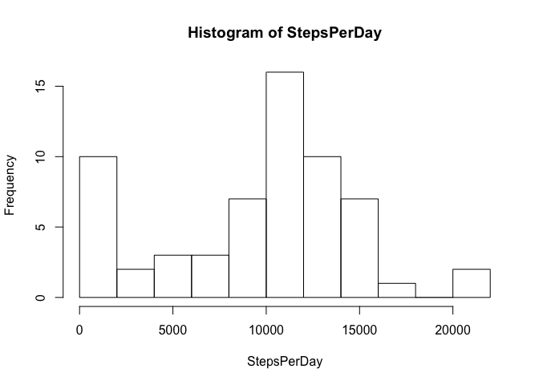

# Reproducible Research: Peer Assessment 1


## Loading and preprocessing the data


```r
unzip("activity.zip", exdir = "activity_data")
activity <- read.csv("activity_data/activity.csv")
```

Next, we want to calculate the mean total number of steps taken per day:


```r
activity$date <- as.Date(activity$date, format = "%Y-%m-%d")
unique_dates <- unique(activity$date)
ndays <- length(unique_dates)
StepsPerDay <- numeric(ndays)
for (i in 1:ndays) {
        StepsPerDay[i] <- sum(activity$steps[activity$date==unique_dates[i]], na.rm=TRUE)
}
```

Let's plot a histogram and provide some summary statistics:


```r
hist(StepsPerDay, breaks=10)
```

 

```r
summary(StepsPerDay)
```

```
##    Min. 1st Qu.  Median    Mean 3rd Qu.    Max. 
##       0    6778   10400    9354   12810   21190
```

The mean number of steps was 9354 and the median was 10400.

Now let's look at the average daily activity pattern. 


```r
unique_intervals <- unique(activity$interval)
nintervals <- length(unique_intervals)
StepsPerInterval <- numeric(nintervals)
for (i in 1:nintervals) {
        StepsPerInterval[i] <- sum(activity$steps[activity$interval==unique_intervals[i]], na.rm=TRUE)
}
FiveMinuteInterval <- 1:nintervals
plot(FiveMinuteInterval,StepsPerInterval[FiveMinuteInterval],type="l")
```

 

The 104rd 5-minute interval, on average across all the days in the dataset, 
contains the maximum number of steps (1.0927\times 10^{4}).

## Imputing missing values

First, let's calculate the total number of missing values in the dataset:


```r
ok <- complete.cases(activity)
sum(!ok)
```

```
## [1] 2304
```

The number of rows with missing values is 2304.

Next, We will fill in the 5-minute intervals that have NA values with the mean value for the day.


```r
nimpute <- sum(!ok)
impute_indeces <- which(is.na(activity$steps))
activity_imputed <- activity
for (i in 1:nimpute) {
        activity_imputed$steps[impute_indeces[i]] <- StepsPerInterval[activity_imputed$interval[impute_indeces[i]]/5 + 1]
}
StepsPerDayImputed <- numeric(ndays)
for (i in 1:ndays) {
        StepsPerDayImputed[i] <- sum(activity_imputed$steps[i], na.rm=TRUE)
}
summary(StepsPerDayImputed)
```

```
##    Min. 1st Qu.  Median    Mean 3rd Qu.    Max. 
##     0.0     7.0    60.0   780.1   972.0  9071.0
```

There is a big difference in the number of daily steps using the imputed values. The estimates go down significantly.

## Are there differences in activity patterns between weekdays and weekends?


```r
require(lubridate)
```

```
## Loading required package: lubridate
```

```r
activity$day = ifelse(wday(activity$date)==1,7,wday(activity$date)-1)

activity$weekend <- factor(activity$day>4)
levels(activity$weekend)[levels(activity$weekend)=="TRUE"] <- "weekend"
levels(activity$weekend)[levels(activity$weekend)=="FALSE"] <- "weekday"
```


```r
weekday_segments <- which(activity$weekend=="weekday")
weekend_segments <- which(activity$weekend=="weekend")

unique_intervals_weekend <- unique(activity$interval[weekend_segments])
unique_intervals_weekday <- unique(activity$interval[weekday_segments])

nintervals_weekend <- length(unique_intervals_weekend)
nintervals_weekday <- length(unique_intervals_weekday)

StepsPerIntervalWeekend <- numeric(nintervals_weekend)
StepsPerIntervalWeekday <- numeric(nintervals_weekday)

for (i in 1:nintervals_weekend) {
        StepsPerIntervalWeekend[i] <- sum(activity$steps[weekend_segments][activity$interval==unique_intervals[i]], na.rm=TRUE)
}

for (i in 1:nintervals_weekday) {
        StepsPerIntervalWeekday[i] <- sum(activity$steps[weekday_segments][activity$interval==unique_intervals[i]], na.rm=TRUE)
}

FiveMinuteIntervalWeekend <- 1:nintervals_weekend
FiveMinuteIntervalWeekday <- 1:nintervals_weekday
```


```r
par(mfrow = c(1, 2))
plot(FiveMinuteIntervalWeekend,StepsPerIntervalWeekend[FiveMinuteIntervalWeekend],type="l")
plot(FiveMinuteIntervalWeekday,StepsPerIntervalWeekday[FiveMinuteIntervalWeekday],type="l")
```

 

It appears that in the week-end the number of steps are more evenly distributed, while in the weekdays, there are more steps early in the day and fewer during the middle of the day.
